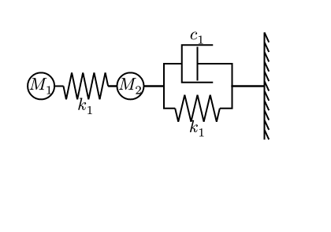

# Typst CeTZ Mechanical System

CeTZ library for drawing mechanical systems.

## Usage

```typst
#import "@preview/cetz-mechanical-system:0.1.0": spring, damper, wall
#import "@preview/cetz:0.3.4"
#import "@preview/circuiteria:0.2.0"
// use circuiteria to utlize the wire,
//which connects anchors with zigzag lines instead of straight lines

#set page(paper: "a8", flipped: true)
#cetz.canvas({
  import cetz.draw: *
  import circuiteria: *
  circle((0, 0), radius: 0.3, name: "mass1")
  spring((0.5, 0), name: "spring1", n: 8, inverse: false)
  circle((2, 0), radius: 0.3, name: "mass2")
  spring((3, -0.5), name: "spring2", n: 7)
  damper((3.15, 0.5), name: "damper", inverse: true)
  wall((5, -1.2), b: (5, 1.2), name: "wall", inverse: false, inverse-lines: false)
  line("mass1", "spring1")
  line("spring1", "mass2")
  line("spring1", "mass2")
  wire.wire("w1", ("mass2", "spring2"), style: "zigzag")
  wire.wire("w2", ("mass2", "damper"), style: "zigzag")
  wire.wire("w3", ("spring2", "wall"), style: "zigzag")
  wire.wire("w3", ("damper", "wall"), style: "zigzag")
  content("mass1", $M_1$)
  content("mass2", $M_2$)
  content("spring1.bottom", $k_1$)
  content("spring2.bottom", $k_1$)
  content("damper.top", $c_1$)
})
```


